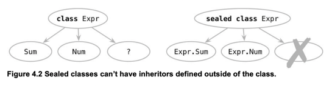

# 4장 클래스, 객체, 인터페이스

## 클래스 계층 정의

1. 코틀린 인터페이스
    - Java : extends / implements
    - Kotlin : ":"
    - 2개 이상의 인터페이스를 구현시 중복 메소드가 있는 경우 -> 컴파일 에러 발생!! -> 반드시 처리 필요
    ```
   코틀린은 자바 6과 호환되게 설계되어 있기 때문에..인터페이스의 디폴트 메소드를 지원하지 않음!!
   Error => Super calls to Java default methods are prohibited in JVM target 1.6. Recompile with '-jvm-target 1.8'
   
   거꾸로 자바에서도... 코틀린의 디폴트 메소드를 사용할 수 없음...
   error: abstract method showOff() in Clickable cannot be accessed directly
    ```
2. open, final, abstract modifier : Default는 final..
    - 자바 final로 명시적으로 상속을 금지하지 않는 이상 상속 가능.. -> 취약한 기반 클래스(fragile base class)
    - 상속을 위한 설계와 문서를 갖추거나, 그럴수 없다면 상속을 금지하라!!
    - 코틀린은 기본적으로 final...
    - Kotlin Access Modifier
        - final
        - open
        - abstract
        - override
3. Visibility Modifier
    - 자바와 비슷한듯 다른듯...
        - 패키지가 코틀린에서는 네임스페이스 관리를 위한 용도로만 사용되기 때문에 관련 패키지 관련 기능은 없음!!
            - ex) package-private

        - 위 기능을 제외하고는 거의 비슷함..
    - 종류
        - public(Default)
        - internal
        - protected
        - private
4. 내부 클래스와 중첩 클래스
    - 클래스 안에 클래스....
    - 중첩 클래스
        - JAVA : static class
        - Kotlin : class A
    - 내부 클러스
        - JAVA : class A
        - Kotlin : inner class A
5. Sealed Class
    - 상위 클래스 안에 반드시 하위 클래스가 존재하게 만들어 실수를 없앰!!
      

## 뻔하지 않은 생성자와 프로퍼티를 갖는 클래스 선언

1. 클래스 초기화(주 생성자와 초기화 블록)
    - 자바
        1. 하나이상의 생성자 선언
    - 코틀린
        1. 주 생성자 / 부 생성자
        2. 초기화 블록을 통한 초기화 로직 추가
        ```kotlin
        class User Constructory(_nickName: String) { //주생성자
            val nickName: String
            init {  // 초기화블록
                nickName = _nickName
            }
        }
        
        //외부에서 Instance를 생성하지 못하게 막고 싶은 경우.... -> "Companion Object"에서 사용예제 자세히 설명..
        //예) 유틸리티 객체... 싱글턴 객체.... 
        class Secretive private constructor()
        ```

2. 부 생성자
    - Default Parameter Values 문법으로 커버 가능
    - 여러개의 생성자가 필요한 경우
        - "여러가지 방법으로 인스턴스를 초기화 할 수 있게 다양한 생성자를 지원해야하는 경우???"
        - 결국!! 자바와의 호환성 때문에 필요한 문법
    - 4.4.2에서 추가적으로 필요한 문법 설명 예정..

3. 인터페이스에 선언된 프로퍼티 구현 : 뻔하지 않는 프로퍼티
    ```kotlin
   interface User {
        val nickname: String
   }

   //PrivateUser는 주 생성자에서 override 메서드를 이용해서 부모의 property값을 처리
   class PrivateUser(override val nickname: String) : User

   //SubscribeingUser는 class 내부에서 명시적으로 nickname을 override하고 custom getter를 제공
   class SubscribeingUser(val email: String) : User { 
       override val nickname: String get() = TODO("Not yet implemented")
   }
   
   //FacebookUser는 함수를 이용하여 nickname값을 설정
   //객체 생성지 한번만 값을 구해서 backing field에 설정해 놓고 호출때마다 저장된 field을 반환
   class FacebookUser(val accountId: Int) : User { 
       override val nickname: String get() = getFacebookName(accountId)
       private fun getFacebookName(accountId: Int): String {
           TODO("Not yet implemented")
      }
   }
   ```
4. Backing Field : Getter / Setter에서 뒷받침하는 필드에 접근
    - 컴파일러에서 자동으로 생성해주는 Field -> Property에 값을 저장하기 위해 사용
    - Set Value에 확장 구현..
    ```kotlin
    class User(val name: String) { 
        var address: String = "unspecified" 
        set(value: String) { 
            println(""" 
                Address was changed for $name: 
                "$field" -> "$value".""".trimIndent()) 
            field = value 
        } 
    } 
    
    fun main(args: Array) { 
        val user = User("Alice") 
        user.address = "Elsenheimerstrasse 47, 80687 Muenchen" 
    }
    ```
5. 접근자의 가시성 변경
    ```kotlin
    class LengthCounter { 
        var counter: Int = 0 
        private set //외부에서 counter Set 불가..
        
        fun addWord(word: String) { 
            counter += word.length 
        } 
    }
    ```

## 컴파일러가 생성한 메소드: 데이터 클래스와 클래스 위임

1. 모든 클래스가 정의해야하는 메소드
    1. toString()
    2. equals()
        - 내용이 같은지 여부
        - "==" 연산을 equality로 치환
        - "===" 참조(주소) 비교
        - 자바와의 차이점
            - primitive type -> equality
            - reference type -> 주소가 같은지 비교..
    3. hashcode()
        - 객체가 같은지 여부
        - equals와 hashcode는 함께 오버라이드 해야함!!
            1. hashcode는 기본적으로 객체의 메모리를 반환함
            2. map / set등 key의 중복여부를 체크하는 로직에서는 값 비교를 하기 전, 비용 효율화를 위해 해시 코드를 비교함
            3. 따라서, 두개는 함께 오버라이드를 해야함

2. 데이터 클래스
    - 데이터를 저장하는 역할을 수행하기 위한 클래스
    - toString, equals, hashcode가 오버라이드됨!!
    - copy()

3. 클래스 위임(by)
    - 시스템의 취약하게 만드는 문제 -> Implementation Inheritance
    - 데코레이터 패턴 -> by
   ```kotlin
   class CountingSet<T>(
      val innerList: MutuableCollection<T> = HashSet<T>()
   ) : MutuableCollection<T> by innerSet { //MutuableCollection 구현을 innerSet에 위임..
      var objectsAdded = 0
      override fun add(element: T) : Boolean { //add는 구현
         objectsAdded++
         return innerSet.add(element)
      }
   
      override fun addAll(c: Collection<T>) : Boolean {  //addAll은 구현
         objectsAdded += c.size
         return innerSet.addAll(c)
      }   
   }
   ```

## object 키워드
```markdown
코틀린에는 static keyword이 없음..
따라서, 이를 대체할만한 표현이 필요하기 때문에 생긴 키워드
```

1. 싱글턴 정의
   - object를 이용하여, 클래스 정의 + 객체 생성 가능 -> 싱글턴 쉽게 생성가능
   ```kotlin
   //단일 객체 생성
   object Payroll {
    val allEmployees = arrayListOf<Person>()
    fun calculateSalary() {
        for (person in allEmployees) {
            //TODO
        }
    }
   }
   
   //Comparator 구현(외부)
   object CaseInsensitiveFileComparator : Comparator<File> {
    override fun compare(o1: File?, o2: File?): Int {
         TODO("Not yet implemented")
    }
   }
   
   data class Person(val name: String) {
       //Comparator 구현(내부)
        object NameComparator : Comparator {
            override fun compare(p1: Person, p2: Person): Int =
                p1.name.compareTo(p2.name)
        }
    }

   fun main(args: Array<String>) {
       val persons = listOf(Person("Bob"), Person("Alice"))
       println(persons.sortedWith(Person.NameComparator))
   }
   ```

   ```java
   CaseInsensitiveFileComparator.INSTANCE.compare(f1, f2);
   ```
2. Companion Object
    - Top-Level Function을 통해 Static Method 처럼 활용 가능
        - top-level function은 class 내부에 선언된 private property에는 접근할 수 없는 제한 
    - 확장 함수에 활용
   ```kotlin
   //Static Method 예제
   class A { 
        companion object { 
            fun bar() { 
                println("Companion object called") 
            } 
        } 
   } 
    
   fun main(args: Array<String>) { 
        A.bar() 
   }
    
   //Factory Pattern 예제
   class User private constructor(val nickname: String) {
        companion object {
            fun newSubscribingUser(email: String) = User(email.substringBefore('@'))
    
            fun newFacebookUser(accountId: Int) = User(getFacebookName(accountId))
        }
   }

   fun main(args: Array<String>) {
        val subscribingUser = User.newSubscribingUser("bob@gmail.com")
        val facebookUser = User.newFacebookUser(4)
        println(subscribingUser.nickname)
   }
   
   class Person(val firstName:String,val lastName:String) {
    companion object
   }
   
   fun Person.Companion.fromJSON(json:String): Person {
        //TODO
   }
   
   val p = Person.fromJSON(json)
   ```
3. Anonymous Object
    - 싱글턴 아님..
    ```kotlin
    interface ClickListener { 
        fun onClick() 
    } 
    
    fun main(args: Array) { 
        setClickAction(object : ClickListener { 
            override fun onClick() { 
                    println("clicked!!!") 
                } 
            } 
        ) 
    }     
    
    fun setClickAction(clickListener: ClickListener) { 
        clickListener.onClick() 
    }
    ```
   
## 결론

```
클래스 관련 문법을 살펴봄
기본적인 문법은 자바와 일부를 제외하고는 거의 다르다고 할 정도로 차이가 남 
새로운 문법 sealed, object, data class 등의 문법은 다시 한번 살펴볼 필요 있음

다만, class에서 생산성적인 장점이 있을까?? 라는 의문이 있음..
java에 lombok이 GA로 들어오게 된다면...과연 장점이 있을지... 
```
