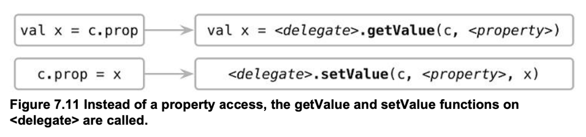

# 7장 연산자 오버로딩과 기타 관례

```markdown
Convention : 연산자와 정해진 이름의 함수를 연결해주는 기법 println("3" + "4")
println(3+4)

//python println("3".__add__("4"))
println((3).__add__(4))

//Java에서 연산자 오버로딩 but 자유롭지는 않다..

//Java에서 연산자 오버로딩을 지원하지 않는 이유 //https://blogs.oracle.com/javamagazine/is-it-time-for-overloading-in-java

//String + 동작방법 //https://jinseongsoft.tistory.com/369
1+2 String str = "abc"
str + "def" //abcdef 
```

## 산술 연산자 오버로딩

1. 이항 산술 연산 오버로딩
    - "+" -> plus
    - "-" -> minus
    - "*" -> times
    - "/" -> div
    - "%" -> rem
    - "<<" -> shl
    - ">>" -> shr
    - ">>>" -> ushr
    - "&" -> and
    - "|" -> or
    - "^" -> xor
    - "~" -> inv

2. 복합 대입 연산자 오버로딩
    - "+=" -> plusAssign
    - "-=" -> minusAssign
    - "*=" -> timesAssign
    - "/=" -> divAssign
   ```markdown
   코틀린은 컬렉션에도 해당 연산지를 제공합니다. 단 아래 규칙에 따릅니다.
    1. +, - 는 항상 새로운 collection을 반환한다
    2. mutable collection에서 +=, -=는 collection을 원소를 변경한다.(새로운 collection을 생성하지 않음)
    3. 불변 collection에서 +=, -=는 새로운 collection을 반환한다. 따라서 이를 받는 변수는 var로 선언되어야 한다
   ```

3. 단항 연산자
    - "+a" -> unaryPlus
    - "-a" -> unaryMinus
    - "!a" -> not
    - "++a, a++" -> inc
    - "--a, a--" -> dec

## 비교 연산자 오버로딩

1. equals
    - "==" -> equals
    - "!=" -> equals
    - extension fuction 구현 불가
        - [ ] Any안에 operator 키워드가 붙어서 구현되어 있음. override keyword를 사용하여 == 와 치환 가능..
   ```markdown
   a == b -> a?.equals(b) ?: (b==null)
   ```

2. compareTo
    - <, >, <=, >= 는 Comparable의 compareTo 함수를 호출
   ```markdown
   a >= b -> a.compareTo(b) >= 0
   ```

## Collection과 Range의 Convention

1. Index
    - get
      ```kotlin
      data class Point(val x: Int, val y: Int) 
      
      operator fun Point.get(index: Int): Int { 
        return when(index) { 
           0 -> x 
           1 -> y 
           else -> throw IndexOutOfBoundsException("Invalid coordinate $index") 
        } 
      } 
      
      fun main(args: Array) { 
        val p = Point(10, 20) 
        println(p[1]) //20 
      }
      ```
      > x[a, b] -> x.get(a, b)
    - set
      ```kotlin
      data class MutablePoint(var x: Int, var y: Int) 
      
      operator fun MutablePoint.set(index: Int, value: Int) { 
        when(index) { 
            0 -> x = value 
            1 -> y = value 
            else -> throw IndexOutOfBoundsException("Invalid coordinate $index") 
        } 
      } 
      
      fun main(args: Array) { 
        val p = MutablePoint(10, 20) 
        p[1] = 42 
        println(p) //42 
      }
      ```
      > x[a, b] = c -> x.set(a ,b, c)

2. "in"
    - "cotains" 함수와 연결
      ```kotlin
      data class Point(val x: Int, val y: Int) 
      data class Rectangle(val upperLeft: Point, val lowerRight: Point) 
      
      operator fun Rectangle.contains(p: Point): Boolean { 
         return p.x in upperLeft.x until lowerRight.x 
                && p.y in upperLeft.y until lowerRight.y 
      } 
      
      fun main(args: Array) { 
       val rect = Rectangle(Point(10, 20), Point(50, 50)) 
       println(Point(20, 30) in rect) 
       println(Point(5, 5) in rect) 
      }
      ```
      > a in c -> c.contains(a)

3. "rangeTo"
    - ".."
      ```kotlin
      fun main(args: Array) { 
        val n = 9 
        println(0..(n + 1))  
        (0..n).forEach { 
            print(it) //0~9
        } 
      }
      ```
      > start..end -> start.rangeTo(end)

4. "iterator"
   ```kotlin
   import java.util.Date 
   import java.time.LocalDate 
   
   operator fun ClosedRange.iterator(): Iterator = 
        object : Iterator { 
            var current = start 
            override fun hasNext() = current <= endInclusive 
            override fun next() = current.apply { 
                current = plusDays(1) 
            }
         }
    
   fun main(args: Array) { 
        val newYear = LocalDate.ofYearDay(2017, 1) 
        val daysOff = newYear.minusDays(1)..newYear 
        for (dayOff in daysOff) { 
            println(dayOff) 
        } 
   }
   ```

## Destructuring declaration 과 component 함수

```kotlin
fun printEntries(map: Map) {
    for ((key, value) in map) { //Destructuring declaration
        println("$key -> $value")
    }
}

data class Point(val x: Int, val y: Int)

fun main(args: Array) {
    val map = mapOf("Oracle" to "Java", "JetBrains" to "Kotlin")
    printEntries(map)

    val p = Point(10, 20)
    val (x, y) = p //Destructuring declaration
    println(x)
    println(y)
}

data class NameComponents(
    val name: String,
    val extension: String
)

fun splitFilename(fullName: String): NameComponents {
    val (name, extension) = fullName.split('.', limit = 2)
    return NameComponents(name, extension)
}
fun main(args: Array) {
    val (name, ext) = splitFilename("example.kt")  //Destructuring declaration
    println(name)
    println(ext)
}
```

> 최대 5개까지만 지원...<br>
> val (a, b) = p ->
> > val a = p.component1<br>
> > val b = p.component2

## Reusing property accessor logic: delegated properties

- get(), set() 동작을 특정 객체가 처리하도록 위임
   ```kotlin
   import kotlin.reflect.KProperty

  class Delegate {
    //getValue / setValue을 반드시 구현 필요(Convention)
    operator fun getValue(thisRef: Any?, property: KProperty<*>): String {
      return "$thisRef, thank you for delegating '${property.name}' to me!"
    }

    operator fun setValue(thisRef: Any?, property: KProperty<*>, value: String) {
        println("$value has been assigned to '${property.name}' in $thisRef.")
    }
  }
  
  class Example {
    var p: String by Delegate() //by키워드를 활용한 Delegate 클래스에 위임..
  }
   ```

- lazy
  ```kotlin
  val lazyValue: String by lazy {
    println("computed!")
    "Hello"
  }
  
  fun main() {
    println(lazyValue)
    println(lazyValue)
  }
  ```
    - 한번만 초기화...
    - Initialize시 람다{...} 구문 사용 -> func등을 활용하여 자유롭게 활용 가능
    - Thread 옵션
        - LazyThreadSafetyMode.SYNCHRONIZED (Default)
        - LazyThreadSafetyMode.PUBLICATION
        - LazyThreadSafetyMode.NONE

- observer
    ```kotlin
    import kotlin.properties.Delegates
    
    class User {
        //Delegates.observable을 활용한 이전 / 이후 값 변경 Observing..
        var name: String by Delegates.observable("<no name>") {
            prop, old, new ->
            println("$old -> $new")
        }
    }
    
    fun main() {
        val user = User()
        user.name = "first"
        user.name = "second"
    }
    //<no name> -> first
    //first -> second
    ```

- Delegate Compile
    - by를 이용하면 간단한 표현으로 property 동작의 재구성이 가능
    - property는 저장하는 위치를 맵, DB, network등에 할수 있도록 하거나, 읽을때 추가작업을 넣을때 편리하게 사용
  ```markdown
    // 실제 코트 
    class Foo { 
        var prop: Type by DelegationObj() 
    } 
  
    fun main() { 
        val c = Foo() 
    } 
    
    // 컴파일된 표현 
    class Foo { 
        private val = DelegationObj() 
        var prop: Type 
            set(value: Type) = <delegate>.setValue(c, <property>, value) //KProperty
            get() = <delegate>.getValue(c, <property>) 
    }



- Map에 property 값 저장

```kotlin
class Person {
    private val _attributes = hashMapOf<String, String>()
    fun setAttribute(attrName: String, value: String) {
        _attributes[attrName] = value
    }
    val name: String by _attributes
}

fun main() {
    val p = Person()
    val data = mapOf("name" to "Dmitry", "company" to "JetBrains")
    for ((attrName, value) in data)
        p.setAttribute(attrName, value)
    println(p.name)
}
```

## 결론

```markdown
자유로운 연산자 오버로딩 및 다양한 컨벤션의 확장 -> 자율성 보장함!!
```