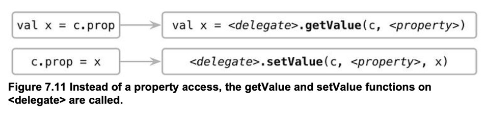

# 7장 연산자 오버로딩과 기타 관례

```markdown
Convention : 연산자와 정해진 이름의 함수를 연결해주는 기법 println("3" + "4")
println(3+4)

//python println("3".__add__("4"))
println((3).__add__(4))

//Java에서의 연산자 오버로딩 but 자유롭지는 않다.. //String + 동작방법 //https://jinseongsoft.tistory.com/369
1+2 String str = "abc"
str + "def" //abcdef
```

## Destructuring declaration 과 component 함수

```kotlin
fun printEntries(map: Map) {
    for ((key, value) in map) { //Destructuring declaration
        println("$key -> $value")
    }
}

data class Point(val x: Int, val y: Int)

fun main(args: Array) {
    val map = mapOf("Oracle" to "Java", "JetBrains" to "Kotlin")
    printEntries(map)

    val p = Point(10, 20)
    val (x, y) = p //Destructuring declaration
    println(x)
    println(y)
}

data class NameComponents(
    val name: String,
    val extension: String
)

fun splitFilename(fullName: String): NameComponents {
    val (name, extension) = fullName.split('.', limit = 2)
    return NameComponents(name, extension)
}
fun main(args: Array) {
    val (name, ext) = splitFilename("example.kt")  //Destructuring declaration
    println(name)
    println(ext)
}
```

> 최대 5개까지만 지원...<br>
> val (a, b) = p ->
> > val a = p.component1<br>
> > val b = p.component2

## Reusing property accessor logic: delegated properties

- get(), set() 동작을 특정 객체가 처리하도록 위임
   ```kotlin
   import kotlin.reflect.KProperty

  class Delegate {
    //getValue / setValue을 반드시 구현 필요(Convention)
    operator fun getValue(thisRef: Any?, property: KProperty<*>): String {
      return "$thisRef, thank you for delegating '${property.name}' to me!"
    }

    operator fun setValue(thisRef: Any?, property: KProperty<*>, value: String) {
        println("$value has been assigned to '${property.name}' in $thisRef.")
    }
  }
  
  class Example {
    var p: String by Delegate() //by키워드를 활용한 Delegate 클래스에 위임..
  }
   ```

- lazy
  ```kotlin
  val lazyValue: String by lazy {
    println("computed!")
    "Hello"
  }
  
  fun main() {
    println(lazyValue)
    println(lazyValue)
  }
  ```
    - 한번만 초기화...
    - Initialize시 람다{...} 구문 사용 -> func등을 활용하여 자유롭게 활용 가능
    - Thread 옵션
        - LazyThreadSafetyMode.SYNCHRONIZED (Default)
        - LazyThreadSafetyMode.PUBLICATION
        - LazyThreadSafetyMode.NONE

- observer
    ```kotlin
    import kotlin.properties.Delegates
    
    class User {
        //Delegates.observable을 활용한 이전 / 이후 값 변경 Observing..
        var name: String by Delegates.observable("<no name>") {
            prop, old, new ->
            println("$old -> $new")
        }
    }
    
    fun main() {
        val user = User()
        user.name = "first"
        user.name = "second"
    }
    //<no name> -> first
    //first -> second
    ```

- Delegate Compile
    - by를 이용하면 간단한 표현으로 property 동작의 재구성이 가능
    - property는 저장하는 위치를 맵, DB, network등에 할수 있도록 하거나, 읽을때 추가작업을 넣을때 편리하게 사용
  ```markdown
    // 실제 코트 
    class Foo { 
        var prop: Type by DelegationObj() 
    } 
  
    fun main() { 
        val c = Foo() 
    } 
    
    // 컴파일된 표현 
    class Foo { 
        private val = DelegationObj() 
        var prop: Type 
            set(value: Type) = <delegate>.setValue(c, <property>, value) //KProperty
            get() = <delegate>.getValue(c, <property>) 
    }



- Map에 property 값 저장

```kotlin
class Person {
    private val _attributes = hashMapOf<String, String>()
    fun setAttribute(attrName: String, value: String) {
        _attributes[attrName] = value
    }
    val name: String by _attributes
}

fun main() {
    val p = Person()
    val data = mapOf("name" to "Dmitry", "company" to "JetBrains")
    for ((attrName, value) in data)
        p.setAttribute(attrName, value)
    println(p.name)
}
```

## 결론

```markdown
자유로운 연산자 오버로딩 및 다양한 컨벤션의 확장 -> 자율성 보장함!!
문법을 
```
