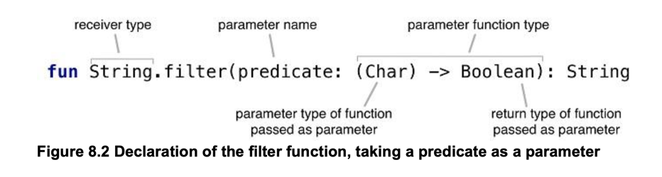

# 8장 고차 함수

## 고차함수 정의

> 정의 : 함수의 인자나, 반환값이 lambda 이거나 function reference 인 경우
>> list.filter { x > 0 }<br>

1. 함수 타입
    - 함수타입은 생략할 수도 있으나, 명시하려면 <b>(인자1:타입, 인자2:타입....) -> 반환타입</b> 으로 표기
    - 인자는 괄호로 묶여야 하고,
    - Unit은 반환값이 없음을 표시.. 실제 타입없이 사용할때는 없어도 되지만 타입을 명시할 때는 필요함.
    ```kotlin
    val sum = { x: Int, y: Int -> x + y }
    val action = { println(42) }
   
    val sum2: (Int, Int) -> Int = { x, y -> x + y } //파라미터 타입 + 반환 타입 -> 함수 타입 문법..
    val action2: () -> Unit = { println(42) }
    ```

2. 인자로 받은 함수 호출
   ```kotlin
    fun twoAndThree(operation: (Int, Int) -> Int) { //함수 타입인 파라미터 선언
        val result = operation(2, 3) //함수 타입인 파라미터 호출
        println("The result is $result")
    }

    fun main(args: Array) {
        twoAndThree { a, b -> a + b }
        twoAndThree { a, b -> a * b }
    }
    
    //filter -> filterTo
    inline fun <C : Appendable> CharSequence.filterTo(destination: C, predicate: (Char) -> Boolean): C {
        for (index in 0 until length) {
            val element = get(index)
            if (predicate(element)) destination.append(element)
        }
        return destination
    }

   ```
   

3. 자바에서 코틀린 함수 타입 사용
    ```java
    //자바8 이상 람다식
    processTheAnswer(x -> x + 1)

    //자바8 이전 Function
    processTheAnswer(new Function1<Integer, Interger> {
        @Override
        public Integer invoke(Integer number) {
            System.out.println(number)
            return number +1
        }
    }
   
   //자바
    List lists = new ArrayList<>();
    list.add("abc");
    list.add("def");

    CollectionKt.forEach(lists, str -> {
        System.out.prinlnt(str);
        return Unit.INSTANCE; //Unit은 반드시 반환
    }
    ```

4. 디폴트 값을 지정한 함수 타입 파라미터나 널이 될 수 있는 함수 타입 파라미터
    ```kotlin
    fun <T> Collection<T>.joinToString(
        separator: String = ", ",
        prefix: String = "",
        postfix: String = "",
        transform: (T) -> String = { it.toString() } //함수 타입 파라미터 지정시 람다 디폴트 값 지정 toString
    ): String {
        val result = StringBuilder(prefix)
    
        for ((index, element) in this.withIndex()) {
            if (index > 0) result.append(separator)
            result.append(transform(element))
        }
    
        result.append(postfix)
        return result.toString()
    }
   
    val letters = listOf("Alpha", "Beta")
    println(letters.joinToString())
    println(letters.joinToString { it.lowercase(Locale.getDefault()) })
    println(
        letters.joinToString(separator = "! ", postfix = "! ",
            transform = { it.uppercase(Locale.getDefault()) })
    )
    ```

5. 함수를 함수에서 반환
    ```kotlin
    enum class Delivery { STANDARD, EXPEDITED }

    class Order(val itemCount: Int)

    fun getShippingCostCalculator(delivery: Delivery): (Order) -> Double { //Return 값이 함수..
        if (delivery == Delivery.EXPEDITED) {
            return { order -> 6 + 2.1 * order.itemCount }
        }
        return { order -> 1.2 * order.itemCount }
    }
    ```

6. 중복제거
    ```kotlin
    enum class OS { WINDOWS, LINUX, MAC, IOS, ANDROID }
    
    data class SiteVisit(
        val path: String,
        val duration: Double,
        val os: OS
    )
    
    val log = listOf(
        SiteVisit("/", 34.0, OS.WINDOWS),
        SiteVisit("/", 22.0, OS.MAC),
        SiteVisit("/login", 12.0, OS.WINDOWS),
        SiteVisit("/signup", 8.0, OS.IOS),
        SiteVisit("/", 16.3, OS.ANDROID)
    )
    
    val averageWindowsDuration = log
        .filter { it.os == OS.WINDOWS }
        .map(SiteVisit::duration)
        .average()
    
    data class SiteVisit2(
        val path: String,
        val duration: Double,
        val os: OS
    )
    
    val log2 = listOf(
        SiteVisit2("/", 34.0, OS.WINDOWS),
        SiteVisit2("/", 22.0, OS.MAC),
        SiteVisit2("/login", 12.0, OS.WINDOWS),
        SiteVisit2("/signup", 8.0, OS.IOS),
        SiteVisit2("/", 16.3, OS.ANDROID)
    )
    
    fun List<SiteVisit2>.averageDurationFor(os: OS) =
        filter { it.os == os }.map(SiteVisit2::duration).average()
    ```

## 인라인 함수

> 람다 -> 익명 클래스 -> 매번 생성되지는 않지만 1회는 생성해야함 -> 성능저하<br>
> 해결방법?? -> inline function

```kotlin
//예제
inline fun String.filter(predicate: (Char) -> Boolean): String {
    return filterTo(StringBuilder(), predicate).toString()
}
```

1. 동작방식
    ```kotlin
    inline fun <T> synchronized(lock: Lock, action: () -> T): T {
        lock.lock()
        try {
            return action()
        } finally {
            lock.unlock()
        }
    }
    ```

2. 제약사항
    - inline으로 사용하려는 함수가 수신된 함수타입 인자를 바로 실행하지 않고, 다른 변수에 저장하고 나중에 그 변수를 사용하는경우에는 inline 함수로 만들 수 없음
    - 함수의 인자로 여러개의 함수타입을 받을때 특정 람다만 inline을 하고 싶지 않다면 noinline 키워드를 붙이면 됨

3. Collection 연산의 Inlining
    - Collection 함수 의 대부분은 람다를 인자로 받음
      ```kotlin
      data class Person(val name: String, val age: Int)
   
      val people = listOf(Person("Alice", 29), Person("Bob", 31))
   
      fun main(args: Array) {
         //filter, map
         println(people.filter { it.age > 30 }.map(Person::name))
      }
      ```
    - 전체 Indexing과 비용에서 차이는 없지만, 중간 연산 결과를 내어 높기 때문에, 결과 생성에 대한 비용이 발생
    - asSequence()를 이용하면 생성 비용을 아낄수 있음 -> 람다 inline X -> 원소가 많을 때 사용하면 좋음!!

4. inline으로 선언이 필요한 경우
    - 람다를 인자로 사용하는 함수에 사용
        - 일반함수의 경우, 컴파일러 단에서 inline을 강력하게 지원하지만, 람다의 경우에는 그렇지 못함 -> 객체 생성 비용을 줄

5. Resource 자동 관리
    - Java7부터 지원하는 try-with-resource 사용불가ㅠㅠ(1.6 호환....)
    - use 함수 제공 -> close안해도 됨...
   ```kotlin
   fun readFirstLineFromFile(path: String): String {
      BufferedReader(FileReader(path)).use { br -> 
         return br.readLine()
      }
   }
   ```

## 고차함수 흐름 제어

1. 내부 return

```kotlin
data class Person(val name: String, val age: Int)

val people = listOf(Person("Alice", 29), Person("Bob", 31))

fun lookForAlice(people: List<Person>) {
    people.forEach {
        if (it.name == "Alice") {
            println("Found!")  // "Found!" 출력 -> non-local return..
            return
        }
    }
    println("Alice is not found")
}

fun main(args: Array) {
    lookForAlice(people)
}
```

2. label을 활용한 local return

```kotlin
fun lookForAlice(people: List<Person>) {
    people.forEach label@{
        if (it.name == "Alice") {
            println("Alice")
            return@label
        }
    }
    println("Alice might be somewhere")
}

println(StringBuilder().apply sb@{
    listOf(1, 2, 3).apply {
        // this로 reciever object(listOf)에 접근하고 @sb로 다시 StringBuilder에 접근했다.
        this@sb.append(this.toString())
    }
})
```

3. 무명함수의 return

```kotlin
data class Person(val name: String, val age: Int)

val people = listOf(Person("Alice", 29), Person("Bob", 31))

fun lookForAlice(people: List<Person>) {
    people.forEach(fun(person) {
        if (person.name == "Alice") return
        println("${person.name} is not Alice")
    })
}

fun main(args: Array<String>) {
    lookForAlice(people)
}
```